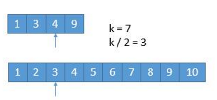
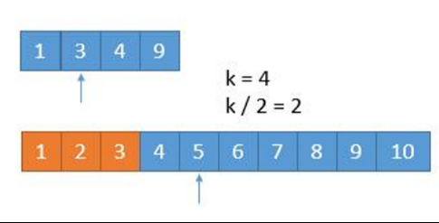
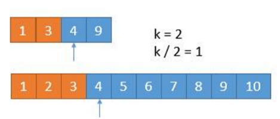

## 1 两个有序数组求第K小的数的算法原理：

假设我们要找第 **7** 小的数字，



我们比较两个数组的第 k/2 个数字，如果 k 是奇数，向下取整。也就是比较第 3 个数字，上边数组中的 4 和下边数组中的 3，如果哪个小，就表明该数组的前 k/2 个数字都不是第 k 小数字，所以可以排除。也就是 1，2，3 这三个数字不可能是第 7 小的数字，我们可以把它排除掉。将 1349 和 45678910两个数组作为新的数组进行比较



由于已经排除掉了 3 个数字，就是这 3 个数字一定在最前边，所以在两个新数组中，我们只需要找第 7 - 3 = 4 小的数字就可以了，也就是 k = 4。此时两个数组，比较第 2 个数字，3 < 5，所以我们可以把小的那个数组中的 1 ，3 排除掉了




又去掉 1 个数字，此时我们要找第 1 小的数字，所以只需判断两个数组中第一个数字哪个小就可以了，也就是 4。**所以第 7 小的数字是 4**。

综合上面的步骤，代码中我们采用**递归**，每次递归根据去掉的数字个数更新K的值：


## 2 源代码

```cpp
//获取第K小的值的算法
int getKthSmall(vector<int> num1, int start1, int end1, vector<int> num2, int start2, int end2, int k)
{
	int len1 = end1 - start1 + 1;
	int len2 = end2 - start2 + 1;
	if (len1 > len2)//此判断，保持个数小的数组排在前面
		return getKthSmall(num2, start2, end2, num1, start1, end1, k);

	if (len1 == 0) //如果num1为空，则直接获取num2中第K个成员
		return num2[start2 + k - 1];

	if (k == 1) //如果k为1，直接比较第一个，返回较小的一个即可
		return min(num1[start1], num2[start2]);

	int i = start1 + min(len1, k / 2) - 1;
	int j = start2 + min(len2, k / 2) - 1;
	if (num1[i] > num2[j])
	{//如果num1中大，则表示num2中的前j个没有要找的第K个成员，跳过继续迭代
		return getKthSmall(num1, start1, end1, num2, j + 1, end2, k - (j - start2 + 1));
	}
	else
	{//如果num2中大，则表示num1中的前i个没有要找的第K个成员，跳过继续迭代
		return getKthSmall(num1, i + 1, end1, num2, start2, end2, k - (i - start1 + 1));
	}
}
```
