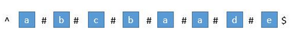
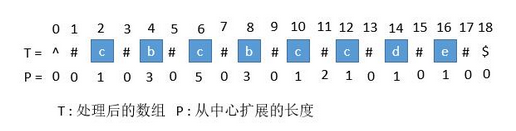
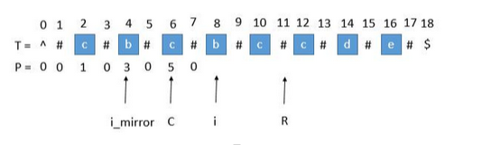
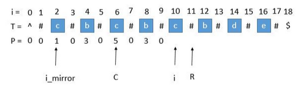

Manacher's Algorithm，中文名叫马拉车算法，是一位名叫Manacher的人在1975年提出的一种算法，解决的问题是求**最长回文子串**，神奇之处在于将算法的时间复杂度精进到了O(N)。


## 1 预处理

首先我们解决下奇数和偶数的问题，在每个字符间插入 "#"，并且为了使得扩展的过程中，到边界后自动结束，在两端分别插入 "^" 和 "$"，两个不可能在字符串中出现的字符，这样中心扩展的时候，判断两端字符是否相等的时候，如果到了边界就一定会不相等，从而退出循环。经过处理，**字符串的长度永远都是奇数**了。




首先我们用一个数组 P 保存从原数组index为中心可扩展回文的最大个数，而它刚好也是去掉 "#" 的原字符串的总长度。例如下图中下标是 6 的地方，可以看到 P[ 6 ] 等于 5，所以它是从左边扩展 5 个字符，相应的右边也是扩展 5 个字符，也就是 "#c#b#c#b#c#"。而去掉 # 恢复到原来的字符串，变成 "cbcbc"，它的长度刚好也就是 5。即`最大回文半径=原数组最大回文长度`。




## 2 求原字符串下标

`原字符串下标index = (i - P[i]) / 2`

例如，上图我们找到 P[ i ] 的最大值为 5，也就是回文串的最大长度是 5，对应的下标是 6，所以原字符串的开头下标是（6 - 5 ）/ 2 = 0。所以我们只需要返回原字符串的第 0 到 第（5 - 1）位就可以了。


## 3 求关键数组P[i]

从上面两个步骤可以看出，数组P[i]是整个算法的关键。

我们用 C 表示回文串的中心，用 R 表示回文串的右边边界，所以 `R = C + P[ i ]`。C 和 R 所对应的回文串是当前循环中 R 最靠右的回文串。那么如何求P[i]呢，如下图：
用 i_mirror 表示当前需要求的第 i 个字符关于 C 对应的对称位置，则`P[i] = P [ i_mirror ] = 3`。

如下三种情况，不能世界上面上一句的公式，需要用中心扩展法另外处理：

- P [i_mirror ] 遇到了原字符串的左边界：
- P [i_mirror ] + i 超过右边界
- I = R


## 4 更新C和R

就这样一步一步的求出每个 P [ i ]，当求出的 P [ i ] 的右边界大于当前的 R 时，我们就需要更新 C 和 R 为当前的回文串了。必须保证 i 在 R 里面，所以一旦有更右边的 R 就要更新 R。



此时的 P [ i ] 求出来将会是 3，P [ i ] 对应的右边界将是 10 + 3 = 13，所以大于当前的 R，我们需要把 C 更新成 i 的值，也就是 10，R 更新成 13。


## 5 源代码

```cpp
//思路2：马拉车算法，线性求最长回文子串
//预处理函数
string preProcess(string s)
{
        int n = s.size();
        if (n == 0)
                return "^$";
        string retStr = "^";
        for (int i = 0; i < n; i++)
        {
                retStr += "#";
                retStr += s[i];
        }
        retStr += "#$";
        return retStr;
}
//马拉车算法
string longestPalindrome(string s)
{
        string T = preProcess(s);
        int n = T.size();
        vector<int> P(n, 0);
        int C = 0, R = 0;
        //找出P的最大值，即最大回文长度，就可以得到原字符串的起始index和最后的回文字符串
        int maxLen = 0;
        int centerIndex = 0;
        for (int i = 1; i < n - 1; i++)
        {
                int i_mirror = 2 * C - i;
                if (R > i)
                {
                        P[i] = min(R - i, P[i_mirror]); // P[i] = P[i_mirror],防止超过R，加min函数
                }
                else
                {
                        P[i] = 0; //等于R，意味着i当前是#字符，所以直接设置0
                }
                //处理三种特殊情况，使用中心扩展方法,因为起始和终结字符分别为^和$，所以while循环最终会退出
                while (T[i + 1 + P[i]] == T[i - 1 - P[i]])
                {
                        P[i] +=1; //检查超过边界之后是否还有可以回文的字符，有则加1
                }
                //判断是否需要更新C和R
                if (i + P[i] > R)
                {
                        C = i;
                        R = i + P[i];
                }
                //保存最大回文半径和中心点
                if (P[i] > maxLen)
                {
                        maxLen = P[i];
                        centerIndex = i;
                }
        }

        int start = (centerIndex - maxLen) / 2; //获取起始index
        return s.substr(start, maxLen);
}
```
